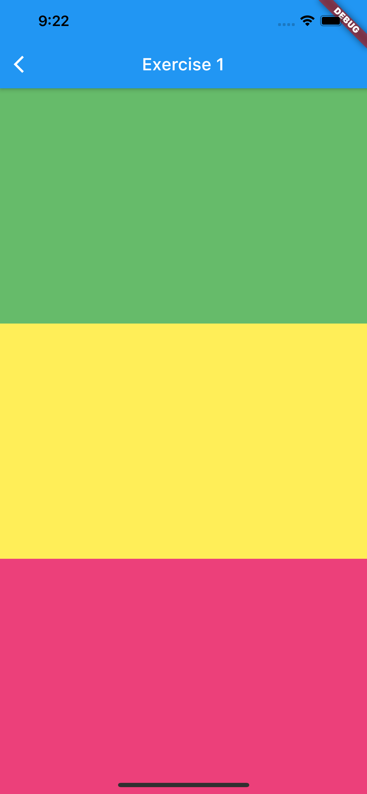
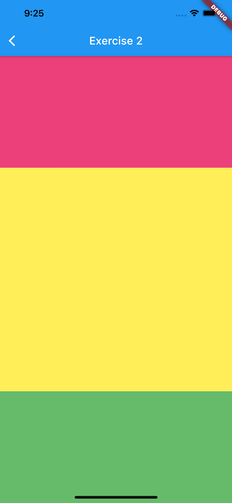
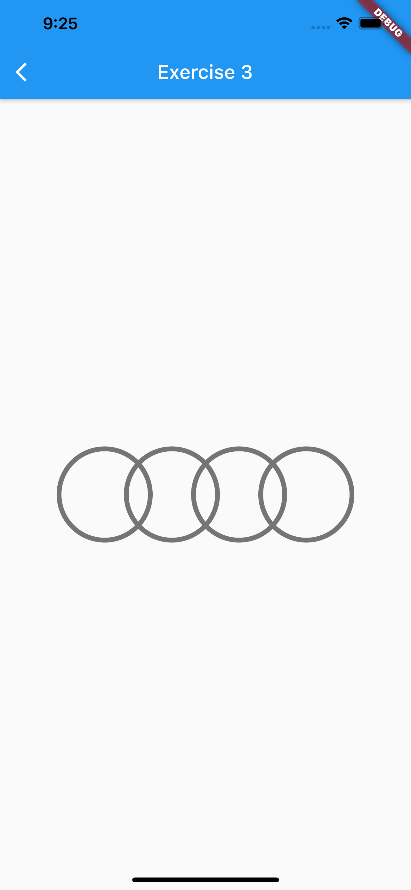
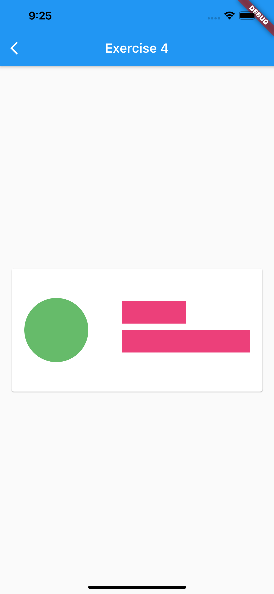
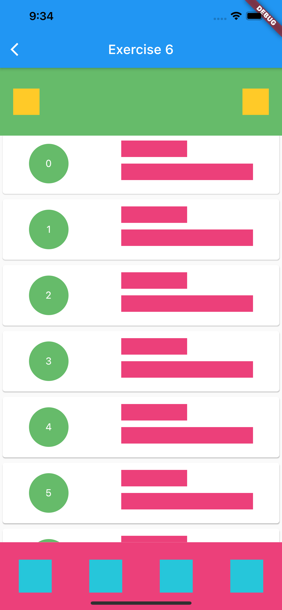

# UI Positioning and Styling Practice

Practise layout and positioning with Flutter.

## Getting Started

- A starter template is provided in this repo. Fork the repo and complete the following exercise in the corresponding widget.
- Don't hesitate to ask questions, and have fun!

#### Exercise 1

- Open ```lib/pages/exercise1.dart``` and reprodue the following layout;
- Items' width and height should be expended;


#### Exercise 2

- Open ```lib/pages/exercise2.dart``` and reprodue the following layout;
- The yellow item should be twice as big as the side items;
- Try to achieve it by adding only 2 lines of code based on ```Exercise 1```;


#### Exercise 3

- Open ```lib/pages/exercise3.dart``` and reprodue the following layout;
- Help me to build a Audi logo using ```Container``` widgets;
- Hint: try ```Stack``` widget and ```List.generate()``` method;


#### Exercise 4

- Open ```lib/pages/exercise4.dart``` and reprodue the following layout;
- Let's create a mock business card;
- It doesn’t have to be precise, but should be sth similiar;


#### Exercise 5

- Open ```lib/pages/exercise5.dart``` and reprodue the following layout;
- Let's build a simple mobile app layout;
- It doesn’t have to be precise, but should be sth similiar;


#### Exercise 6

- Open ```lib/pages/exercise6.dart``` and reprodue the following layout;
- Let's re-use the ```business card``` widget from ```Exercise 4``` and build a different app layout;
- Try to use ```ListView``` widget to build the business card list;
- It doesn’t have to be precise, but should be sth similiar;

