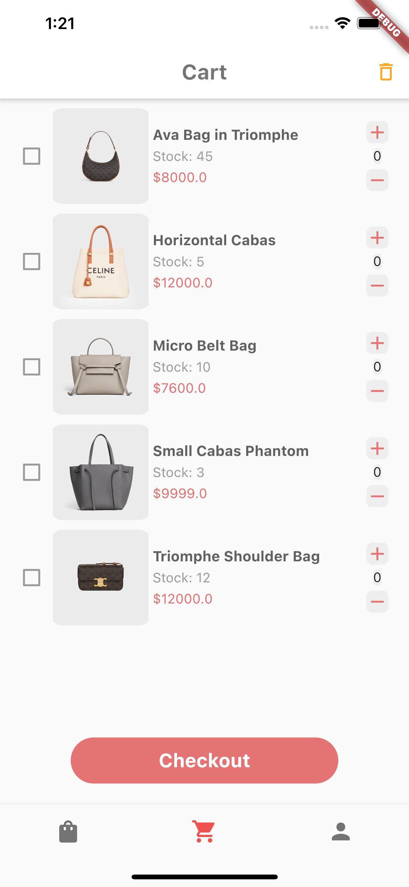
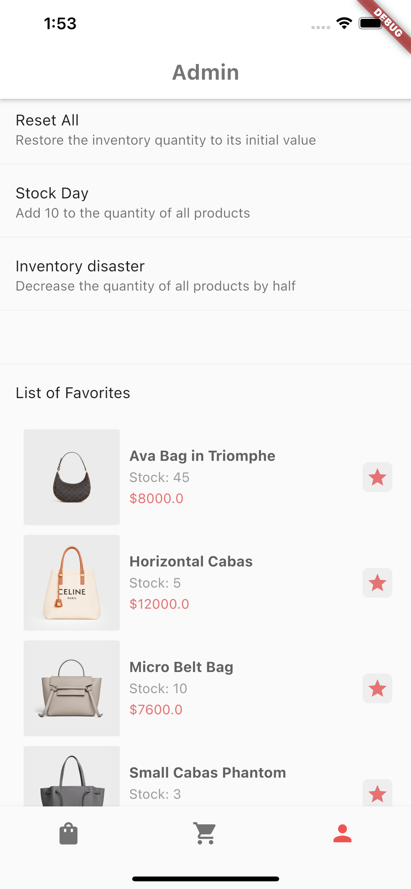

## Let's Make PaiPai (拍拍网) Great Again

### Background
- TaoBao has dominated the online shopping market for a long time, and has made it difficult for other niche platforms to survive. 
- Recently, Pony Ma decided to re-assess their previous online shopping platform, __PaiPai(拍拍网)__, and invited you to join his force. Your task is to build a Flutter-based PaiPai mobile app and prove the concept to the board of directors.

### Tasks
1. Build a Flutter mobile app with the following pages:
   
   

    - `Product List`: a page that lists and interacts with products from Paipai
        - It consists of a product grid. This grid has two columns and allows one to view more products by scrolling.
        - On the right side of the App Bar is a search icon that lets you search/filter products by tapping it and typing keywords in the input box.
        - Each item in the grid shows the basic product info: picture, name, price, and stock level. There are also __purchase__ and __favorite__ buttons.

    

    - `Shopping Cart`: a page that retains and manages products placed in your shopping cart
        - It is a `List View` that contains all products that added to the shopping cart from the `Product List` page.
        - Here, users can increase or decrease the number of purchases, or they can move items out of the shopping cart.
        - There is also a `Checkout` button at the bottom of the page to perform mock purchases, which simply __removes the purchased quantity from the inventory__ and __emptys the shopping cart__.
  
    

    - `Administration Panel`: A page that helps us manage inventory and display favorite products
        - This page provides 3 features(button) to help us interact with inventory
            - `Reset All`: Restore the inventory quantity to its initial value
            - `Stock Day`: Add 10 to the quantity of all products
            - `Inventory disaster`: Decrease the quantity of all products by half
        - This page should also presents all favorite products through the `List View`, and provide button to un-favorite any.

2. Implement all features that presented on UI pages by using any state management manner you prefer. (Cubit is recommended) Details:
    - The initial state should include a list of product objects (say 20), which contain the product's image path, name, price, stock quantity, and whether it is favorite.
    - The user can filter out the target product through the search function on the Product List page.
    - Tap the shopping cart icon on the product card to put it in the shopping cart, and tap the favorites icon to favorite it (reversible). The results of the operation can be rendered in the shopping cart or favorites list.
    - One can increase and decrease the number of purchases, or remove products from the shopping cart. But it must be restricted to the stock level.
    - The purchased quantity after checkout must be deducted from inventory and the shopping cart needs to be emptied.
    - After the inventory action (`Reset All` / `Stock Day` / `Inventory disaster`) is tapped, the inventory quantity needs to change accordingly. These numbers should be updated on all pages.
    - The favorites list needs to show all the favorite products and provide button to un-favorite any. The results of the operation should be reflected on both favorite list and product list.

3. Write tests for your implementation. 
    - This includes unit tests for both utils and states.
    - Test coverage will be one of the factors take into account the quality of your tests.