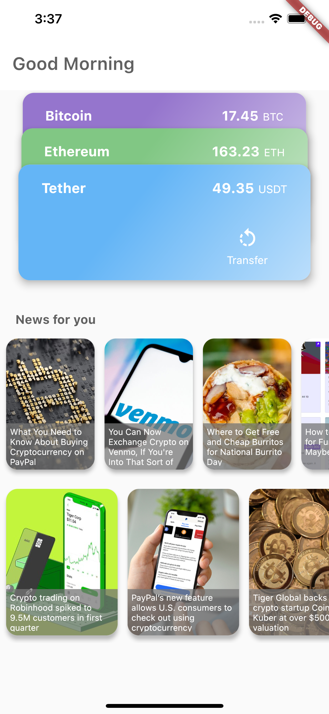
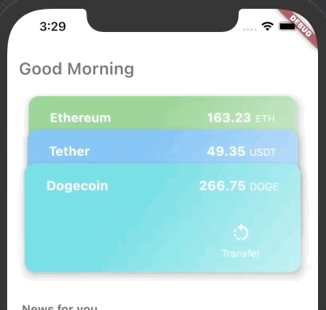

# Digital Currency Wallet

### Background
- The dramatic price-rising of bitcoin has led to a new wave of investment in digital currency.
- In this exercise, let's build a mock wallet app related to digital currencies.

<div style="text-align:center"></div>


### Tasks
You are asked to implement the following features:
1. A landing page with __2__ major sections: ```Accounts``` and ```News```.
    - Accounts
        - Users usually invest/manage multiple digital currencies, so multiple account information needs to be displayed, and each account is presented in the form of a card.
        - Each card should display the correct account __name__, __balance__, and __transfer__ icon button. <span style="color:red">(these information can be constants stored in the state)</span>
        - As shown in the figure below, all the cards are stacked together but with a fixed distance on the y-axis. One can slide the card at the top of the stack to the bottom.
        - ```Suggested package:``` [Swipe Stack](https://pub.dev/packages/swipe_stack)
    
    <div style="text-align:center"></div>

    - News
        - The second part is used to recommend digital currency-related news to users. These news information can be fetched from ```https://newsapi.org/```.
        - News are displayed in the form of cards on the Landing page, and each card contains the title and image of the corresponding news. <span style="color:red">(these information can be obtained from the api response)</span>
        - Here you only need to display about 20 news cards in a row, and use ```ListView``` for browsing.
        - You need to display a progress indicator while waiting for response, and perform correct error handling.
        - When the news card is clicked, it will navigate to another page where users can view the complete news, including: image, title, author, time, and news content.
        - Tip: Use Dio to send a request, get news data, and store it in the ```state```. UI should go consume the state.
        - ```Suggested package:``` [Dio](https://pub.dev/packages/dio), [Cached Network Image](https://pub.dev/packages/cached_network_image) 

    <div style="text-align:center"></div>
                  
2. Account Transfer
    - Tapping the transfer icon button will trigger a bottom-sheet.
    - This sheet will first display the balance of the clicked card/account, and provide a form for the user to enter the transfer information, including: the recipient's email, name, and amount. 
    - Optional: Try to add form validation, and only enable the ```Continue``` button after all inputs are completed.
    - After clicking ```Continue```, a second bottom-sheet will pop up. This sheet is used to double confirm user's input. If any changes are needed, user can click the ```Change``` button to return to the previous sheet and make changes. Otherwise, user can click ```Transfer``` to execute the mock transaction.
    - <span style="color:red">There is no need to update any account information in the state.</span>
    - ```Suggested package:``` [Modal Bottom Sheet](https://pub.dev/packages/modal_bottom_sheet)
    <div style="text-align:center"></div>