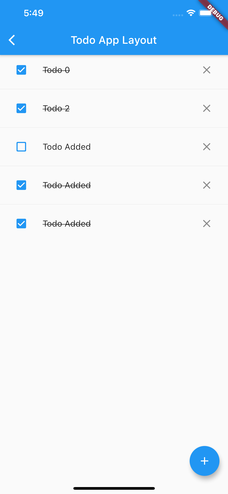

## Getting Started

- A starter template named `state_management` has provided in this repo. Fork the repo and complete the following exercise in the corresponding widget.

- Don't hesitate to ask questions, and have fun!

## Todo App Exercise 1

- open `lib/exercise1/layout.dart`
- Build a layout of each Todo item, each item should have a checkbox icon at the leading of the item and a close icon at the trailing of the item.
- Add a floating add icon on the bottom right of the app.

> hits: use `ListView` widget

## Todo App Exercise 2

- Open `lib/exercise2/todo_cubit.dart` and `lib/exercise2/todo_state.dart`
- Implement the logic of cubit and state by comments in code.
- Run `flutter test path/to/state_management/test/todo_cubit_test.dart` to pass the unit test for this cubit.

> hits: ensure all your unit tests passed before exercise 3

## Todo App Exercise 3

- Open `lib/exercise3/todo_page.dart`
- Integrate your cubit (you can import it from your exercise2) with your layout.
- **Case 1:** User can tap bottom right button to add a new Todo item. 
- **Case 2:** User can tap leading checkbox to change the Todo item's complete state.
- **Case 3:** User can remove a Todo item by pressing the trailing close button.
