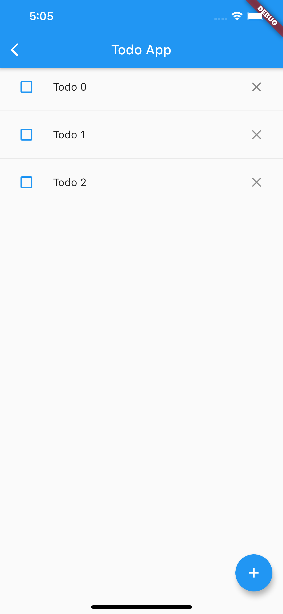
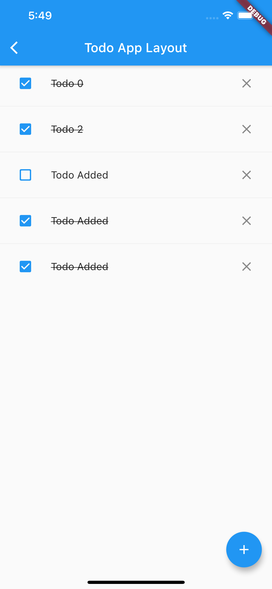

# State Management

## State management methods

- setState

- Provider

- BLoC (**B**usiness **Lo**gic **C**omponent)

- Redux / Mobx

## setState

### StatelessWidget

 ```dart
 class MyText extends StatelessWidget {
 
   @override
   Widget build(BuildContext context) {
     return Text('Counter');
   }
 }
 ```


### StatefulWidget

 ```dart
 class Counter extends StatefulWidget {
   @override
   _CounterState createState() => _CounterState();
 }
 
 class _CounterState extends State<Counter> {
   int count = 0;
   
   @override
   void initState() {
     // 
     
   }
   
   @override
   void didChangeDependencies() {
     context.read<>();
     Dio().get('/path').then(
       (response) => setState(() {
         count = response.data;
       })
     );
   }
 
   @override
   Widget build(BuildContext context) {
     return ElevatedButton(
       child: Text('$count'),
       onPressed: () => setState(() => count++),
     );
   }
 }
 ```


### Compare to React useState

 ```React TSX
 function Counter() {
   const [count, setCount] = useState(0);
   
   return (
     <button onClick={() => setCount((prev) => prev+1)}>
       {count}
     </button>
   );
 } 
 ```


### Who should manage state?

- Widget itself

- Parent widget

- Another object

### Some rules

- If the state is user data, such as the status of checkbox, the position of slider, it should be managed by parent widget.

- If the state is related to appearance and layout, such as color, animation, it should be managed by widget it self.

- If one state is shared by different widgets and should be managed by their common parent widget.

## Provider

### Prepare data model

 ```dart
 class CounterModel extends ChangeNotifier {
   int count = 0;
 
   void increment() {
     count++;
     notifyListeners();
   }
   
   
 }
 ```


### Wrap widgets with provider

 ```dart
 class ProviderCounterPage extends StatelessWidget {
   @override
   Widget build(BuildContext context) {
     return ChangeNotifierProvider(
       create: (_) => CounterModel(),
       child: Builder(
         builder: (context) => Scaffold(
           appBar: AppBar(title: Text('Provider Counter Page')),
           body: Center(
             child: Column(
               mainAxisAlignment: MainAxisAlignment.center,
               children: <Widget>[
                 Text('You have pushed the button this many times:'),
                 Text(
                   context.watch<CounterModel>().count.toString(),
                   style: Theme.of(context).textTheme.headline4,
                 ),
               ],
             ),
           ),
           floatingActionButton: FloatingActionButton(
             onPressed: context.read<CounterModel>().increment,
             tooltip: 'Increment',
             child: Icon(Icons.add),
           ), // This trailing comma makes auto-formatting nicer for build methods.
         ),
       ),
     );
   }
 }
 ```


### Why build widgets in a builder's callback method？

Because the parameter context in a build method is refer to its parent widget.

 ```dart
 class ProviderCounterPage extends StatelessWidget {
   @override
   Widget build(BuildContext context) {
     return ChangeNotifierProvider(
       create: (_) => CounterModel(),
       child: CounterPage(),
     );
   }
 }
 
 class CounterPage extends StatelessWidget {
   @override
   Widget build(BuildContext context) {
     return Scaffold(
       appBar: AppBar(title: Text('Provider Counter Page')),
       body: Center(
         child: Column(
           mainAxisAlignment: MainAxisAlignment.center,
           children: <Widget>[
             Text('You have pushed the button this many times:'),
             Text(
               context.watch<CounterModel>().count.toString(),
               style: Theme.of(context).textTheme.headline4,
             ),
           ],
         ),
       ),
       floatingActionButton: FloatingActionButton(
         onPressed: context.read<CounterModel>().increment,
         tooltip: 'Increment',
         child: Icon(Icons.add),
       ), // This trailing comma makes auto-formatting nicer for build methods.
     );
   }
 }
 ```


### StatefulWidget's Lifecycle

`createState` → `initState` →  `didChangeDependencies` → `build`

**Current context ready after build method.**

- `initState` is called only **once** for a widget. (Called when new widget is inserted into the tree)

- `didChangeDependencies` may be called **multiple times** per widget lifecycle (in my case it was called when the keyboard appears / disappears)


### What's the difference between read and write?

Extension methods from `flutter_bloc`

 ```dart
 extension ReadContext on BuildContext {
   T read<T>() {
     return Provider.of<T>(this, listen: false);
   }
 }
 
 extension WatchContext on BuildContext {
   T watch<T>() {
     return Provider.of<T>(this);
   }
 }
 
 ```


## BLoC pattern and cubit


### Benefits?

- Divide UI layout and business logic.

- Easy to write unit tests for business logic.

- UI = f(data)


### Build basic cubit

 ```dart
 import 'package:flutter_bloc/flutter_bloc.dart';
 
 class CounterCubit extends Cubit<int> {
   CounterCubit() : super(0);
 
   void increment() {
     emit(state + 1);
   }
 }
 
 ```


### Provide cubit to your layout

 ```dart
 class CubitCounterPage extends StatelessWidget {
   @override
   Widget build(BuildContext context) {
     return BlocProvider<CounterCubit>(
       create: (_) => CounterCubit(),
       child: Builder(
         builder: (context) => Scaffold(
           appBar: AppBar(title: Text('Cubit Counter Page')),
           body: Center(
             child: Column(
               mainAxisAlignment: MainAxisAlignment.center,
               children: <Widget>[
                 Text('You have pushed the button this many times:'),
                 Text(
                   context.watch<CounterCubit>().state.toString(),
                   style: Theme.of(context).textTheme.headline4,
                 ),
               ],
             ),
           ),
           floatingActionButton: FloatingActionButton(
             onPressed: context.read<CounterCubit>().increment,
             tooltip: 'Increment',
             child: Icon(Icons.add),
           ), // This trailing comma makes auto-formatting nicer for build methods.
         ),
       ),
     );
   }
 }
 
 ```


### Write cubit test

 ```dart
 blocTest<CounterCubit, int>(
   'It should increment counter',
   build: () => CounterCubit(),
   act: (cubit) => cubit.increment(),
   expect: [1],
 );
 
 blocTest<CounterCubit, int>(
   'It should increment counter when initial value is 6',
   build: () => CounterCubit(),
   seed: 6,
   act: (cubit) => cubit.increment(),
   expect: [7],
 );
 ```


## Exercise

[Github Repo Link](https://github.com/MichaelCTH/Flutter-Practical-Assignment-2021/blob/master/state_management/README.md)

### Exercise 1 - Essential layout

- open `lib/exercise1/layout.dart`

- Build a layout of each Todo item, each item should have a checkbox icon at the leading of the item and a close icon at the trailing of the item.

- Add a floating add icon on the bottom right of the app.




> hits: use ListView widget


### Exercise 2 - Implement cubit

- Open `lib/exercise2/todo_cubit.dart` and `lib/exercise2/todo_state.dart`

- Implement the logic of cubit and state by comments in code.

- Run `flutter test path/to/state_management/test/todo_cubit_test.dart` to pass the unit test for this cubit.

> hits: ensure all your unit tests passed before exercise 3


### Exercise 3 - Integrate cubit with layout

- Open `lib/exercise3/todo_page.dart`

- Integrate your cubit (you can import it from your exercise2) with your layout.

- **Case 1:** User can tap bottom right button to add a new Todo item.

- **Case 2:** User can tap leading checkbox to change the Todo item's complete state.

- **Case 3:** User can remove a Todo item by pressing the trailing close button.





